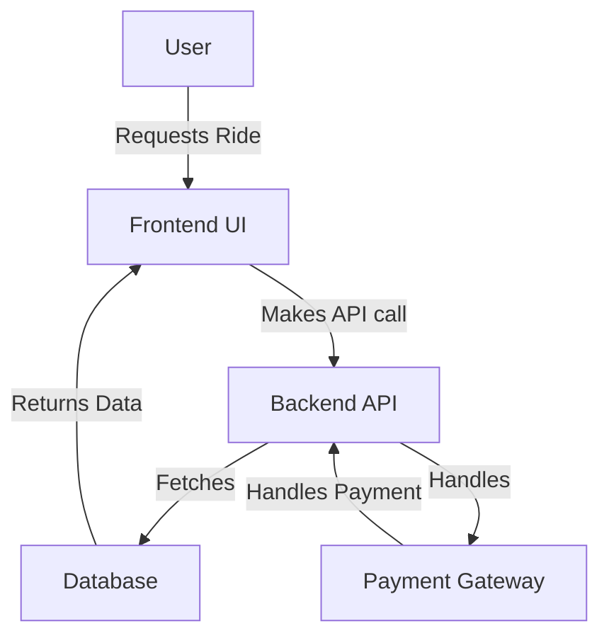

# Design Document for Smart Airport Ride Pooling

## Overview
The Smart Airport Ride Pooling application aims to provide an efficient and user-friendly ride-sharing solution for airport passengers, enhancing their travel experience.

## System Architecture

## Features
- User Registration and Login
- Ride Request and Pooling
- Driver and Passenger Ratings
- Payment Processing

## Conclusion
This document outlines the high-level architecture and functionalities of the Smart Airport Ride Pooling application.